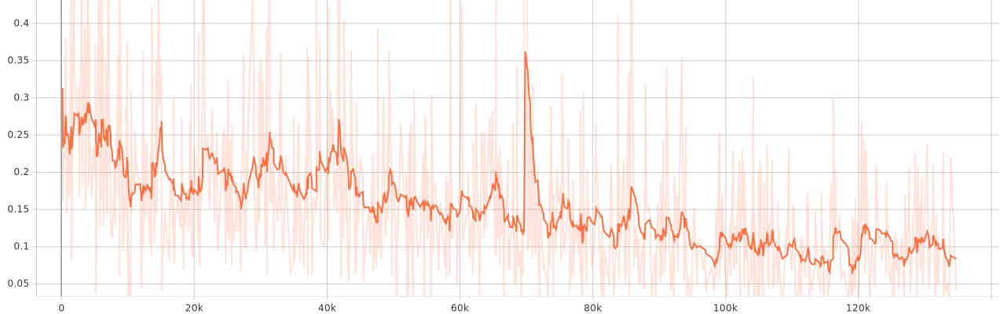
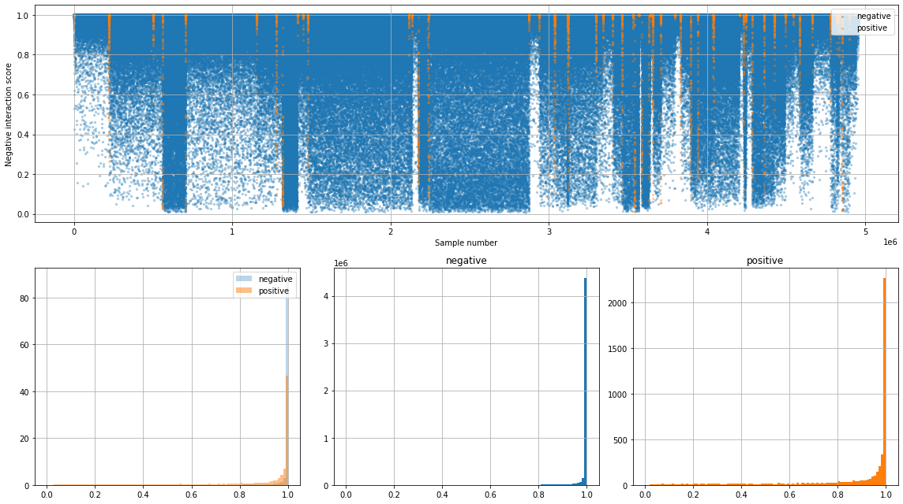

[TensorFlow] Protein Interface Prediction using Graph Convolutional Networks
=====
Unofficial TensorFlow implementation of Protein Interface Prediction using Graph Convolutional Networks [1].  

## Usage
``` sh
$ unzip dataset.zip
$ python run.py
```

## Dataset

### Number of samples
|Set|Complex|Positive|Negative|
|:---|---:|---:|---:|
|Training|140|12866 (9.1 %)|128660 (90.9 %)|
|Validation|35|3138 (0.2 %)|31380 (99.8 %)|
|Test|55|4871 (0.1 %)|4953446 (99.9 %)|

<div align="center">
  <p>
    
    
  </p>
  <p>Sample view for Ligand and Receptor respectively.</p>
</div>

### Feature description

```
Graph
│
├── Vertex: 70 features
│    ├── Windowed Position Specific Scoring Matrix: 20
│    ├── Relative Accessible Surface Area: 1
│    ├── Residue Depth: 2
│    ├── Protrusion Index: 6
│    ├── Hydrophobicity: 1
│    └── Half Sphere Amino Acid Composition: 40
└── Edge: 2 features
     ├── Average Atomic Distance: 1
     └──  CCαO Angle: 1
```

## Result
* Refer that the results shown below are temporary results. (AUROC: 0.66456)  
* The model tuning process is not finished completely.  
<div align="center">
  <p>
    
  </p>
  <p>Loss graph.</p>
</div>
<div align="center">
  <p>
    
  </p>
  <p>Results of the test process. The first figure (upper side) shows the negative interaction score between ligand and receptor. The lower side figures show a histogram of negative interaction score of negative labeled and positive labeled sample.</p>
</div>

## Reference
[1] Fout, Alex M. <a href="https://mountainscholar.org/handle/10217/185661">Protein interface prediction using graph convolutional networks</a>. Diss. Colorado State University, 2017.  
[2] Supplementary Data for NIPS Publication: Protein Interface Prediction using Graph Convolutional Networks. https://zenodo.org/record/1127774#.WkLewGGnGcY
